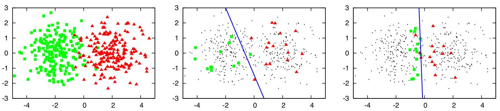
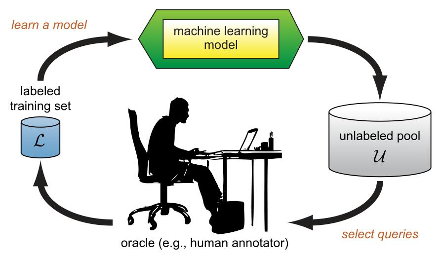

# Awesome Active Learning [](https://awesome.re)

🤩 A curated list of awesome Active Learning ! 🤩

<font size=5><b> Background </b></font>



(`An illustrative example of pool-based active learning`. image source: [Settles, Burr](https://minds.wisconsin.edu/handle/1793/60660))

<font size=5><b> What is Active Learning? </b></font>

Active learning is a special case of machine learning in which a learning algorithm can interactively query a oracle (or some other information source) to label new data points with the desired outputs.



(`The pool-based active learning cycle`. image source: [Settles, Burr](https://minds.wisconsin.edu/handle/1793/60660))

There are situations in which unlabeled data is abundant but manual labeling is expensive. In such a scenario, learning algorithms can actively query the oracle for labels. This type of iterative supervised learning is called active learning. Since the learner chooses the examples, the number of examples to learn a concept can often be much lower than the number required in normal supervised learning. With this approach, there is a risk that the algorithm is overwhelmed by uninformative examples. Recent developments are dedicated to multi-label active learning, hybrid active learning and active learning in a single-pass (on-line) context, combining concepts from the field of machine learning (e.g. conflict and ignorance) with adaptive, incremental learning policies in the field of online machine learning.

(source: [Wikipedia](https://en.wikipedia.org/wiki/Active_learning_(machine_learning)))

<font size=5><b> Contributing </b></font>

If you find the awesome paper/code/book/tutorial or have some suggestions, please feel free to [pull requests](https://github.com/baifanxxx/awesome-active-learning/pulls) or contact <baifanxxx@gmail.com> or <chenliangyudavid@gmail.com> to add papers using the following Markdown format:

``` txt
Year | Paper Name | Conference | [Paper](link) | [Code](link) | Tags | Notes |
```

<font size=4><b> Tags </b></font>

`Sur.`: survey                     |  `Cri.`: critics                    |
`Pool.`: pool-based sampling       |  `Str.`: stream-based sampling      |  `Syn.`: membership query synthesize  |
`Semi.`: semi-supervised learning  |  `Self.`: self-supervised learning  |  `RL.`: reinforcement learning        |
`FS.`: few-shot learning           |  `Meta.`: meta learning             |

Thanks for your valuable contribution to the research community. 😃

---

<font size=5><center><b> Table of Contents </b></center></font>

- [Awesome Active Learning ](#awesome-active-learning-)
- [Books](#books)
- [Surveys](#surveys)
- [Papers](#papers)
  - [Before 2017](#before-2017)
  - [2017](#2017)
  - [2018](#2018)
  - [2019](#2019)
  - [2020](#2020)
  - [2021](#2021)
  - [2022](#2022)
- [Turtorials](#turtorials)
- [Tools](#tools)

---

# Books

* [Active Learning](https://www.morganclaypool.com/doi/abs/10.2200/S00429ED1V01Y201207AIM018). Burr Settles. (CMU, 2012)

# Surveys

| Year | Paper | Author | Publication | Code | Notes |
| --- | --- | :---: | :---: |  --- | --- |
| 2009 | [Active Learning Literature Survey](https://minds.wisconsin.edu/handle/1793/60660) | Settles, Burr. | University of Wisconsin-Madison Department of Computer Sciences |  |  |
| 2020 | [A Survey of Deep Active Learning](https://arxiv.org/abs/2009.00236) | Pengzhen Ren et al. | CSUR |  |  |
| 2021 | [A Survey on Active Deep Learning: From Model-driven to Data-driven](https://arxiv.org/abs/2101.09933) | Peng Liu et al. | arXiv |  |  |

# Papers

## Before 2017

|Year| Title        | Publication |  Paper  |  Code  | Tags | Notes |
|----| --------     | :-----: |  :----: | :----: |----|----|
|1994|Improving Generalization with Active Learning|Machine Learning|[paper](https://link.springer.com/content/pdf/10.1007/BF00993277.pdf)||   |     |
|2007|Discriminative Batch Mode Active Learning|NIPS|[paper](https://dl.acm.org/doi/pdf/10.1145/1390156.1390183)| [code](https://github.com/dsgissin/DiscriminativeActiveLearning) |   |     |
|2008|Active Learning with Direct Query Construction|KDD|[paper](https://dl.acm.org/doi/abs/10.1145/1401890.1401950)||   |  |
|2008|An Analysis of Active Learning Strategies for Sequence Labeling Tasks|EMNLP|[paper](https://www.aclweb.org/anthology/D08-1112.pdf)||   |     |
|2008|Hierarchical Sampling for Active Learning|ICML|[paper](https://citeseerx.ist.psu.edu/viewdoc/download?doi=10.1.1.92.8661&rep=rep1&type=pdf)||   |  |
|2010|Active Instance Sampling via Matrix Partition|NIPS|[paper](http://people.scs.carleton.ca/~yuhongguo/research/papers/activenips10figs.pdf)||   |     |
|2011|Ask Me Better Questions: Active Learning Queries Based on Rule Induction|KDD|[paper](https://dl.acm.org/doi/abs/10.1145/2020408.2020559)||   |     |
|2011|Active Learning from Crowds|ICML|[paper](https://openreview.net/pdf?id=yVemp8x6Av3y)||   |     |
|2011|Bayesian Active Learning for Classification and Preference Learning|CoRR|[paper](https://arxiv.org/abs/1112.5745)| [code](https://github.com/cambridge-mlg/BALaudiogram)|   |     |
|2011|Active Learning Using On-line Algorithms|KDD|[paper](https://dl.acm.org/doi/abs/10.1145/2020408.2020553)||   |     |
|2012|Bayesian Optimal Active Search and Surveying|ICML|[paper](https://arxiv.org/abs/1206.6406)| [code](https://github.com/rmgarnett/active_search)|   |     |
|2012|Batch Active Learning via Coordinated Matching|ICML|[paper](https://arxiv.org/abs/1206.6458)||   |     |
|2013|Active Learning for Multi-Objective Optimization|ICML|[paper](http://proceedings.mlr.press/v28/zuluaga13.html)||   |     |
|2013|Active Learning for Probabilistic Hypotheses Usingthe Maximum Gibbs Error Criterion|NIPS|[paper](https://eprints.qut.edu.au/114032/)||   |     |
|2014|Active Semi-Supervised Learning Using Sampling Theory for Graph Signals|KDD|[paper](https://dl.acm.org/doi/abs/10.1145/2623330.2623760)| [code](https://github.com/broshanfekr/Active_Semi-Supervised_Learning_Using_Sampling_Theory_for_Graph_signals) |   |     |
|2014|Beyond Disagreement-based Agnostic Active Learning|NIPS|[paper](https://arxiv.org/abs/1407.2657)||   |     |
|2015|Multi-Label Active Learning from Crowds| arXiv |[paper](https://arxiv.org/pdf/1508.00722v1.pdf)||   |     |
|2016|Cost-Effective Active Learning for Deep Image Classification|TCSVT|[paper](https://arxiv.org/pdf/1701.03551.pdf)| [code](https://github.com/dhaalves/CEAL_keras) |   |     |
|2016|Active Image Segmentation Propagation|CVPR|[paper](http://openaccess.thecvf.com/content_cvpr_2016/papers/Jain_Active_Image_Segmentation_CVPR_2016_paper.pdf)||   |     |

## 2017

| Title        | Publication |  Paper  |  Code  | Tags | Notes |
| --------     | :-----: |  :----: | :----: |----|----|
|Active Decision Boundary Annotation with Deep Generative Models|ICCV|[paper](http://openaccess.thecvf.com/content_ICCV_2017/papers/Huijser_Active_Decision_Boundary_ICCV_2017_paper.pdf)| [code](https://github.com/MiriamHu/ActiveBoundary) |||
| Active One-shot Learning         |CoRR|[paper](https://arxiv.org/abs/1702.06559)|[code](https://github.com/markpwoodward/active_osl)|`Str.` `RL.` `FS.`|     |
| A Meta-Learning Approach to One-Step Active-Learning         |AutoML@PKDD/ECML|[paper](https://arxiv.org/abs/1706.08334)||`Pool.` `Meta.`|     |
| Generative Adversarial Active Learning         |arXiv|[paper](https://arxiv.org/abs/1702.07956)||`Pool.` `Syn.`|     |
|Active Learning from Peers|NIPS|[paper](http://papers.neurips.cc/paper/7276-active-learning-from-peers.pdf)||||
|Learning Active Learning from Data|NIPS|[paper](https://arxiv.org/abs/1703.03365)|[code](https://github.com/ksenia-konyushkova/LAL)|`Pool.`||
|Learning Algorithms for Active Learning|ICML|[paper](http://proceedings.mlr.press/v70/bachman17a.html)||||
| Deep Bayesian Active Learning with Image Data|ICML|[paper](http://proceedings.mlr.press/v70/gal17a)|[code](https://github.com/Riashat/Active-Learning-Bayesian-Convolutional-Neural-Networks/tree/master/ConvNets/FINAL_Averaged_Experiments/Final_Experiments_Run)|`Pool.`   |     |
|Learning how to Active Learn: A Deep Reinforcement Learning Approach|EMNLP|[paper](https://arxiv.org/abs/1708.02383)|[code](https://github.com/mengf1/PAL)|`Str.` `RL.`||

## 2018

| Title        | Publication |  Paper  |  Code  | Tags | Notes |
| --------     | :-----: |  :----: | :----: |----|----|
|The Power of Ensembles for Active Learning in Image Classification|CVPR|[paper](http://openaccess.thecvf.com/content_cvpr_2018/papers/Beluch_The_Power_of_CVPR_2018_paper.pdf)||||
| Adversarial Learning for Semi-Supervised Semantic Segmentation |BMVC|[paper](https://arxiv.org/abs/1802.07934)|[code](https://github.com/hfslyc/AdvSemiSeg)|`Pool.` `Semi.`|  |
|A Variance Maximization Criterion for Active Learning|Pattern Recognition|[paper](https://www.sciencedirect.com/science/article/pii/S0031320318300256)| [code](https://github.com/YazhouTUD/MVAL) |||
|Meta-Learning Transferable Active Learning Policies by Deep Reinforcement Learning|ICLR-WS|[paper](https://arxiv.org/abs/1806.04798)||`Pool.` `Meta.` `RL.`||
|Active Learning for Convolutional Neural Networks: A Core-Set Approach|ICLR|[paper](https://openreview.net/pdf?id=H1aIuk-RW)||||
|Adversarial Active Learning for Sequence Labeling and Generation|IJCAI|[paper](https://www.ijcai.org/proceedings/2018/0558.pdf)||||
|Meta-Learning for Batch Mode Active Learning|ICLR-WS|[paper](https://openreview.net/references/pdf?id=r1PsGFJPz)||||

## 2019

| Title        | Publication |  Paper  |  Code  | Tags | Notes |
| --------     | :-----: |  :----: | :----: |----|----|
| Generative Adversarial Active Learning for Unsupervised Outlier Detection | TKDE | [paper](https://arxiv.org/pdf/1809.10816v4.pdf) | [code](https://github.com/leibinghe/GAAL-based-outlier-detection) |||
| Bayesian Generative Active Deep Learning    |ICML|[paper](http://proceedings.mlr.press/v97/tran19a.html)|[code](https://github.com/toantm/BGADL)|`Pool.` `Semi.`|   |
| Variational Adversarial Active Learning    |ICCV|[paper](https://openaccess.thecvf.com/content_ICCV_2019/html/Sinha_Variational_Adversarial_Active_Learning_ICCV_2019_paper.html)|[code](https://github.com/sinhasam/vaal)|`Pool.` `Semi.`|   |
|Integrating Bayesian and Discriminative Sparse Kernel Machines for Multi-class Active Learning|NeurIPS|[paper](https://papers.nips.cc/paper/2019/hash/bcc0d400288793e8bdcd7c19a8ac0c2b-Abstract.html)|| |   |
|Active Learning via Membership Query Synthesisfor Semi-supervised Sentence Classification|CoNLL|[paper](https://www.aclweb.org/anthology/K19-1044/)|| |   |
|Discriminative Active Learning|arXiv|[paper](https://arxiv.org/pdf/1907.06347.pdf)| [code](https://github.com/dsgissin/DiscriminativeActiveLearning) | |   |
|Semantic Redundancies in Image-Classification Datasets: The 10% You Don’t Need|arXiv|[paper](https://arxiv.org/pdf/1901.11409.pdf)|| |   |
|On-the-Fly Bayesian Active Learning of Interpretable Force-Fields for Atomistic Rare Events|npj Computational Materials|[paper](https://arxiv.org/pdf/1904.02042v2.pdf)| [code](https://github.com/mir-group/flare) | |   |
|Bayesian Batch Active Learning as Sparse Subset Approximation|NIPS|[paper](http://papers.nips.cc/paper/8865-bayesian-batch-active-learning-as-sparse-subset-approximation.pdf)| [code](https://github.com/rpinsler/active-bayesian-coresets) | |   |
| Learning Loss for Active Learning   |CVPR|[paper](https://openaccess.thecvf.com/content_CVPR_2019/html/Yoo_Learning_Loss_for_Active_Learning_CVPR_2019_paper.html)|[code](https://github.com/Mephisto405/Learning-Loss-for-Active-Learning)|`Pool.` |   |
|Rapid Performance Gain through Active Model Reuse|IJCAI|[paper](http://www.lamda.nju.edu.cn/liyf/paper/ijcai19-acmr.pdf)|| |   |
|Parting with Illusions about Deep Active Learning|arXiv|[paper](https://arxiv.org/abs/1912.05361)||`Cri.` |   |
|BatchBALD: Efficient and Diverse Batch Acquisition for Deep Bayesian Active Learning|NIPS|[paper](http://papers.nips.cc/paper/8925-batchbald-efficient-and-diverse-batch-acquisition-for-deep-bayesian-active-learning.pdf)| [code](https://github.com/BlackHC/BatchBALD) | |   |

## 2020

| Title        | Publication |  Paper  |  Code  | Tags | Notes |
| --------     | :-----: |  :----: | :----: |----|----|
| Reinforced active learning for image segmentation |ICLR|[paper](https://arxiv.org/abs/2002.06583)|[code](https://github.com/ArantxaCasanova/ralis)|`Pool.` `RL.`| |
|Deep Batch Active Learning by Diverse, Uncertain Gradient Lower Bounds|ICLR|[paper](https://arxiv.org/abs/1906.03671)|[code](https://github.com/JordanAsh/badge)|`Pool.`| |
|Adversarial Sampling for Active Learning|WACV|[paper](https://openaccess.thecvf.com/content_WACV_2020/html/Mayer_Adversarial_Sampling_for_Active_Learning_WACV_2020_paper.html)||`Pool.`| |
|Online Active Learning of Reject Option Classifiers|AAAI|[paper](https://ojs.aaai.org/index.php/AAAI/article/view/6019/5875)||| |
| ViewAL: Active Learning with Viewpoint Entropy for Semantic Segmentation |CVPR|[paper](https://openaccess.thecvf.com/content_CVPR_2020/html/Siddiqui_ViewAL_Active_Learning_With_Viewpoint_Entropy_for_Semantic_Segmentation_CVPR_2020_paper.html)| [code](https://github.com/nihalsid/ViewAL) |`Pool.`| |
|Deep Active Learning for Biased Datasets via Fisher Kernel Self-Supervision|CVPR|[paper](http://openaccess.thecvf.com/content_CVPR_2020/papers/Gudovskiy_Deep_Active_Learning_for_Biased_Datasets_via_Fisher_Kernel_Self-Supervision_CVPR_2020_paper.pdf)| [code](https://github.com/gudovskiy/al-fk-self-supervision) || |
| Deep Reinforcement Active Learning for Medical Image Classification   |MICCAI|[paper](https://link.springer.com/chapter/10.1007/978-3-030-59710-8_4)||`Pool.` `RL.`| |
| State-Relabeling Adversarial Active Learning  |CVPR|[paper](https://openaccess.thecvf.com/content_CVPR_2020/html/Zhang_State-Relabeling_Adversarial_Active_Learning_CVPR_2020_paper.html)|[code](https://github.com/Beichen1996/SRAAL)|`Pool.`  | |
|Towards Robust and Reproducible Active Learning Using Neural Networks|arXiv|[paper](https://arxiv.org/pdf/2002.09564)| [code](https://github.com/acl21/deep-active-learning-pytorch) |`Cri.`| |
| Minimax Active Learning | arXiv |[paper](https://arxiv.org/pdf/2012.10467v2.pdf)|||  |
| Bayesian Force Fields from Active Learning for Simulation of Inter-Dimensional Transformation of Stanene | npj Computational Materials | [paper](https://arxiv.org/pdf/2008.11796v2.pdf) | [code](https://github.com/mir-group/flare) ||  |
|Consistency-Based Semi-supervised Active Learning: Towards Minimizing Labeling Cost|ECCV|[paper](https://link.springer.com/chapter/10.1007/978-3-030-58607-2_30)||`Pool.` `Semi.`| |
|Cold-start Active Learning through Self-supervised Language Modeling|EMNLP|[paper](https://arxiv.org/abs/2010.09535)| [code](https://github.com/forest-snow/alps) |`Pool.` `SS.`||

## 2021

| Title        | Publication |  Paper  |  Code  | Tags | Notes |
| --------     | :-----: |  :----: | :----: |----|----|
| Active learning with MaskAL reduces annotation effort for training Mask R-CNN | arXiv | [paper](https://arxiv.org/abs/2112.06586) | [code](https://github.com/pieterblok/maskal) |  |  |
| MedSelect: Selective Labeling for Medical Image Classification Combining Meta-Learning with Deep Reinforcement Learning   |arXiv|[paper](https://arxiv.org/abs/2103.14339)| [code](https://github.com/stanfordmlgroup/MedSelect) |`Pool.` `Meta.` `RL.`|  |
| Can Active Learning Preemptively Mitigate Fairness Issues |ICLR-RAI|[paper](https://arxiv.org/abs/2104.06879)|[code](https://github.com/ElementAI/active-fairness)|`Pool.`|Thinking fairness issues|
|Sequential Graph Convolutional Network for Active Learning |CVPR|[paper](https://arxiv.org/pdf/2006.10219.pdf)|[code](https://github.com/razvancaramalau/Sequential-GCN-for-Active-Learning)|`Pool.`| |
|Task-Aware Variational Adversarial Active Learning |CVPR|[paper](https://arxiv.org/abs/2002.04709)|[code](https://github.com/cubeyoung/TA-VAAL)|`Pool.`| |
|Effective Evaluation of Deep Active Learning on Image Classification Tasks |arXiv|[paper](https://arxiv.org/abs/2106.15324)||`Cri.`| |
|Semi-Supervised Active Learning for Semi-Supervised Models: Exploit Adversarial Examples With Graph-Based Virtual Labels |ICCV|[paper](https://openaccess.thecvf.com/content/ICCV2021/papers/Guo_Semi-Supervised_Active_Learning_for_Semi-Supervised_Models_Exploit_Adversarial_Examples_With_ICCV_2021_paper.pdf)||`Pool.` `Semi.`| |
|Contrastive Coding for Active Learning under Class Distribution Mismatch |ICCV|[paper](https://openaccess.thecvf.com/content/ICCV2021/html/Du_Contrastive_Coding_for_Active_Learning_Under_Class_Distribution_Mismatch_ICCV_2021_paper.html)|[code](https://github.com/RUC-DWBI-ML/CCAL)|`Pool.`|Defines a good question|
|Mind Your Outliers! Investigating the Negative Impact of Outliers on Active Learning for Visual Question Answering |ACL-IJCNLP|[paper](https://arxiv.org/abs/2107.02331)|[code](https://github.com/siddk/vqa-outliers)|`Pool.`|Thinking about outliers |
|LADA: Look-Ahead Data Acquisition via Augmentation for Active Learning |NeurIPS|[paper](https://arxiv.org/abs/2011.04194)||`Pool.`| |
|Multi-Anchor Active Domain Adaptation for Semantic Segmentation |ICCV|[paper](https://arxiv.org/abs/2108.08012)|[code](https://github.com/munanning/mada)|`Pool.`| |
|Active Learning for Lane Detection: A Knowledge Distillation Approach |ICCV|[paper](https://openaccess.thecvf.com/content/ICCV2021/html/Peng_Active_Learning_for_Lane_Detection_A_Knowledge_Distillation_Approach_ICCV_2021_paper.html)||`Pool.`| |
|Active Contrastive Learning of Audio-Visual Video Representations |ICLR|[paper](https://arxiv.org/abs/2009.09805)|[code](https://github.com/yunyikristy/CM-ACC)|`Pool.`| |
|Multiple instance active learning for object detection |CVPR|[paper](https://arxiv.org/abs/2104.02324)|[code](https://github.com/yuantn/MI-AOD)|`Pool.`| |
|SEAL: Self-supervised Embodied Active Learning using Exploration and 3D Consistency |NeurIPS|[paper](https://arxiv.org/abs/2112.01001)||`Self.`|Robot exploration|
|Influence Selection for Active Learning |ICCV|[paper](https://openaccess.thecvf.com/content/ICCV2021/html/Liu_Influence_Selection_for_Active_Learning_ICCV_2021_paper.html)|[code](https://github.com/dragonlzm/ISAL)|`Pool.`||
|Reducing Label Effort: Self-Supervised meets Active Learning |arXiv|[paper](https://arxiv.org/abs/2108.11458)||`Pool.` `Self.` `Cri.`| A meaningful attempt on the combination of SS & AL|
|Towards General and Efficient Active Learning |arXiv|[paper](https://arxiv.org/abs/2112.07963)|[code](https://github.com/yichen928/GEAL_active_learning)|`Pool.` `Self.`| Single-pass AL based on SS ViT|
|Cartography Active Learning |EMNLP Findings|[paper](https://arxiv.org/abs/2109.04282)|[code](https://github.com/jjzha/cal)|`Pool.`| |
|Joint Semi-supervised and Active Learning for Segmentation of Gigapixel Pathology Images with Cost-Effective Labeling |ICCVW|[paper](https://openaccess.thecvf.com/content/ICCV2021W/CDPath/papers/Lai_Joint_Semi-Supervised_and_Active_Learning_for_Segmentation_of_Gigapixel_Pathology_ICCVW_2021_paper.pdf)||`Pool.`| Cold-start problem|

## 2022

| Title        | Publication |  Paper  |  Code  | Tags | Notes |
| --------     | :-----: |  :----: | :----: |----|----|
|Budget-aware Few-shot Learning via Graph Convolutional Network |arXiv|[paper](https://arxiv.org/abs/2201.02304)||`Pool.` `Meta.` `FS.`||

# Turtorials

* [Overview of Active Learning for Deep Learning](https://jacobgil.github.io/deeplearning/activelearning). Jacob Gildenblat.
* [Active Learning from Theory to Practice](https://www.youtube.com/watch?v=_Ql5vfOPxZU). Steve Hanneke, Robert Nowak. (ICML, 2019)

# Tools

* [modAL: A modular active learning framework for Python](https://github.com/modAL-python/modAL). Tivadar Danka and Peter Horvath. (2018)
* [ALiPy: Active Learning in Python](https://github.com/NUAA-AL/alipy). Ying-Peng Tang, Guo-Xiang Li, Sheng-Jun Huang. (NUAA, 2019)
* [[BAAL] A Bayesian Active Learning Library](https://github.com/ElementAI/baal/). Atighehchian, Parmida and Branchaud-Charron, Frederic and Freyberg, Jan and Pardinas, Rafael and Schell, Lorne. (2019)
